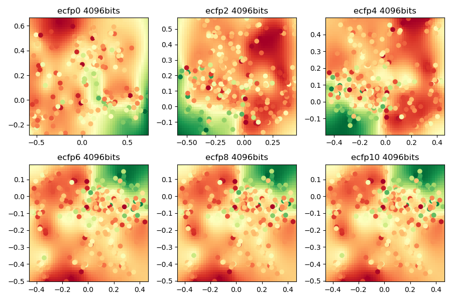

# Principal Component Analysis

## pca.py

3 ways to calculate principal component analysis.

## fp.py

Plot pc1 and pc2 and molecular solubility.

- conda install -c openbabel openbabel
- solubility.test.sdf from RDKit repository

## pca.js

Javascript implementation. [Demo](https://taneishi.github.io/pca)

## Environments and Licenses

- Chart.js: MIT 
- w2ui: MIT
- jQuery: MIT
- D3.js: BSD-3-Clause
